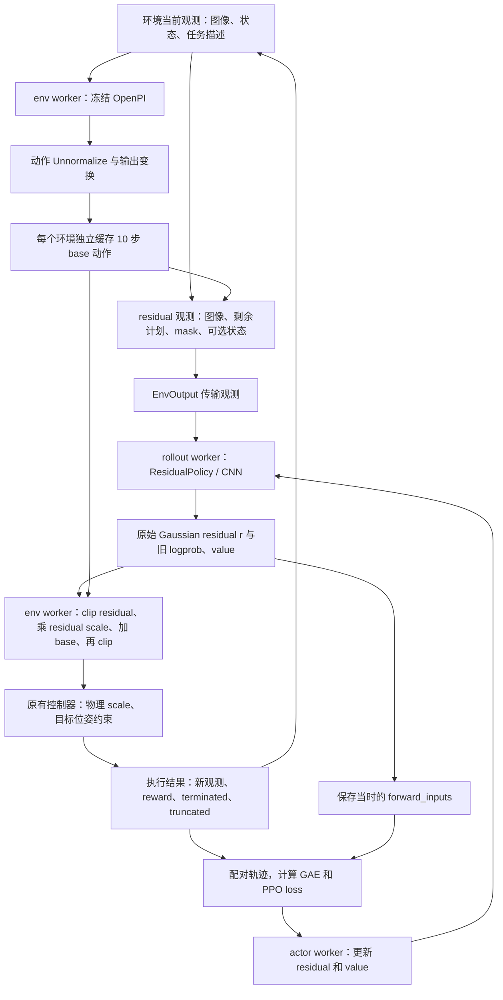

# Residual 接入后的完整数据链路与 scale 顺序

整理日期：2026-09-07。依据本地 RLinf-4090 当前源码、实验配置及已有 `residual_ppo_implementation_notes_zh.md` 重新整理。你之前说的 **skill 已明确为 scale（缩放）**，本文统一使用 scale。

当前实现把“OpenPI 输出动作并执行”扩展为“冻结 OpenPI 给出基础动作计划，CNN 每步生成修正，环境合成后执行，PPO 根据执行结果训练 CNN”。**加法发生在 OpenPI 动作反归一化之后、机器人控制器物理 scale 之前；residual 自己的 scale 则在加法之前。**

本文描述已写入本地代码的行为。当前接入限定为单节点 ManiSkill PnP 仿真，尚未覆盖 4090 + NUC 真机或 sim/real co-training。仓库还有其他未提交修改，以下仅说明 residual 相关链路，不能把全部 Git diff 都归入这次改动。

## 1. 修改前后，数据流发生了什么变化

这里以原有 OpenPI 执行动作的链路作为对照。

| 环节 | 原有 OpenPI 执行动作 | 当前 residual 接入 |
| --- | --- | --- |
| 在线观测 | 图像、状态等送给 OpenPI | 同一环境观测供 OpenPI 使用，并生成 residual 所需的图像和 base 计划条件 |
| 基础策略 | OpenPI 输出动作块 | 冻结 OpenPI 放在 env worker 内推理，缓存默认 10 步动作 |
| 每步决策 | 使用 base 动作 | rollout worker 的 CNN 读取最新观测和剩余计划，输出单步 residual |
| 执行动作 | base 动作进入控制器 | env worker 将当前 base 动作与缩放后的 residual 相加、裁剪，再送控制器 |
| 在线训练数据 | OpenPI 推理本身不产生 residual PPO 样本 | 保存 residual 观测条件、原始采样动作、旧 logprob/value，并配对环境奖励与结束标记 |
| 参数更新 | 取决于原实验训练配置 | PPO 更新 residual 可训练参数和 value head，OpenPI 保持冻结 |
| 参数同步 | 原 rollout 模型的参数 | actor → rollout 同步 residual 模型；base 不随 PPO 更新 |



## 2. 观测进入模型：分成 base 和 residual 两条支路

**Base 支路。** `ResidualManiskillEnv._wrap_obs()` 先调用原有环境观测包装，再让冻结 OpenPI 使用图像、原始机械臂状态和任务信息。OpenPI 沿用 checkpoint 对应的输入变换及 Normalize，预测结果经过 Unnormalize 和后续输出变换后才放进缓存。没有让 residual 参与 OpenPI 的输入归一化或内部动作生成。

**Residual 支路。** 环境给观测新增 `base_actions` 和 `base_action_mask`。`EnvOutput.prepare_observations()` 新增对这两个字段的保留，避免跨 worker 传输时被原有固定字段列表丢弃。若 `use_state=false`，环境在 base 推理之后移除发给 residual 的原始状态。

默认数据形状如下，B 表示并行环境数：

| 输入 | 默认形状 | 进入 residual CNN 前的处理 |
| --- | --- | --- |
| `main_images` | `[B,128,128,3]`，uint8 | 复用 CNN 图像预处理：float、除 255、ImageNet mean/std 等 |
| `extra_view_images` | `[B,1,128,128,3]` | 第二视角，复用 CNN 图像处理 |
| `base_actions` | `[B,10,7]` | 剩余动作前移，末尾补零；乘有效 mask 后展平成 70 维 |
| `base_action_mask` | `[B,10]` | 有效位置为 1，无效位置为 0，拼接为 10 维条件 |
| 原始 `states` | 开启时 `[B,14]` | 可选追加；配置 mean/std 时可独立标准化 |

为了复用现有 CNN 的数值输入接口，`ResidualPolicy._prepare_cnn_obs()` 将这些条件放入 CNN 的 `states` 通道：

```text
默认 use_state=false：flatten(base_actions × mask) 拼接 mask        → 80 维
开启 use_state=true： 上述条件再拼接原始机械臂状态                  → 94 维
```

因此，代码中的 CNN `states` 不一定表示机械臂状态。关闭 `use_state` 只是不直接给 residual 追加 14 维原始状态；OpenPI 仍会读取状态，base 计划也仍可能携带状态信息。base 动作条件不会再次应用 OpenPI norm stats。

## 3. base 缓存：10 步计划，逐步修正

`BaseActionCache` 为每个环境维护动作块和读取位置。首次观测、缓存用尽或该环境 reset 后，才对需要刷新的环境调用 OpenPI，并取前 `base_horizon=10` 步。

例如 OpenPI 返回 `[b0,b1,...,b9]`：

| 时刻 | residual 看到的计划 | mask | 本步合成使用 |
| --- | --- | --- | --- |
| 第一步 | `[b0,b1,...,b9]` | 10 个 1 | `b0` |
| 已执行 3 步 | `[b3,...,b9,0,0,0]` | 7 个 1、3 个 0 | `b3` |
| 最后一步 | `[b9,0,...,0]` | 1 个 1、9 个 0 | `b9` |
| 10 步执行完 | 用新观测刷新下一块 | 重新全有效 | 新计划首步 |

Residual 的 `num_action_chunks=1`，每步都读取最新图像并重新决策；chunk 内 base 计划仍来自该块生成时的观测。缓存仅在 `compose()` 实际执行一步时推进；额外读取观测或计算 value 不推进位置。部分环境 reset 只使对应缓存失效，其他环境继续自己的计划。

## 4. scale 的确切位置：区分三种变换

### 4.1 OpenPI 的统计反归一化

OpenPI 输出顺序为：

```text
模型动作 → model_transforms.outputs → Unnormalize
         → data_transforms.outputs → repack_transforms.outputs → base 动作 b
```

这里恢复的是 SFT 数据记录的动作表达，**不自动等于米或弧度**。当前 residual 代码要求 b 与 PnP 控制器的归一化增量输入处于同一空间。若实际 checkpoint 学的是物理单位增量，需先做单位适配，不能直接相加后再乘控制器 scale；这项兼容性尚需用实际 checkpoint 验证。

### 4.2 residual scale：先缩放修正，再相加

环境中实际执行的公式是：

```python
r_bounded = clip(r, -1, 1)
delta = alpha * r_bounded
a_env = clip(b + delta, -1, 1)
```

其中 r 是 CNN 原始 Gaussian 采样值；b 是缓存当前步的 base 动作；alpha 来自 `actor.model.residual_action_scale`，通过 YAML 插值传给 `env.train/eval.residual.action_scale`。

默认 `alpha=[0.1,0.1,0.1,0.1,0.1,0.1,0.0]`：前六维允许修正，夹爪不加 residual。网络内部只学习六个活跃通道，输出扩展为七维时夹爪补零。最终统一裁剪仍可能限制越界的 base 夹爪动作。

这里没有先单独裁剪 b，也没有 tanh squash。`actor.model.action_scale` 是原 CNN 的另一个可选动作变换开关，当前 residual 构造函数要求它为 None；调 residual 应使用 `residual_action_scale`。

### 4.3 控制器物理 scale：对合成结果换算

合成的 `a_env` 继续进入原有 `ManiskillEnv.step()` 和机器人控制器。当前配置 `controller_alignment.action_scale=[0.01,0.05,1.0]`；机械臂控制器将位置三维乘 0.01、旋转三维乘 0.05，再计算目标位姿并施加原有范围约束。夹爪沿用原有控制分支。

所以如果你说“scale 之后加 residual”，需要明确是哪一个 scale：**当前是在 residual 自身 scale 之后相加，而在控制器物理 scale 之前相加。**

例如某个位置轴 `b=0.4, r=0.3`：

```text
residual 修正 = 0.1 × 0.3 = 0.03
合成控制输入 = 0.4 + 0.03 = 0.43
目标增量尺度 = 0.43 × 0.01 m = 4.3 mm
相对 base 的目标增量修正 = 0.3 mm
```

默认最大每轴 residual 位置输入对应 1 mm，旋转输入对应 0.005 rad；这些仅是没有饱和及位姿约束影响时的目标增量尺度，不保证实际运动距离。若 `b=0.99,r=2`，最终输入为 1，实际增加只有 0.01，而非 0.1。当前仿真控制频率为 5 Hz。

## 5. 回传给 PPO 的数据：保存采样动作及其当时的条件

PPO 学习的是“在这个观测和 base 计划下，应采样什么 residual”。环境奖励来自最终合成动作的执行结果。两种动作必须分清：

| 数据 | 保存内容 | 作用 |
| --- | --- | --- |
| 发给环境的 residual | `[B,1,7]` 单步动作块 | 环境取单步值与缓存合成 |
| `forward_inputs.action` | `[B,7]` 原始 Gaussian residual，未 clip、未乘 alpha | 更新时计算同一个采样值的概率 |
| `forward_inputs.main_images/extra_view_images` | 当时的图像 | 更新时重新编码 |
| `forward_inputs.states` | 当时已拼接的 80/94 维条件 | 固定当时的剩余 base 计划、mask 和可选状态 |
| `prev_logprobs` | 旧策略对原始 residual 的 logprob | PPO 新旧策略概率比 |
| `prev_values` | 旧 value 估计 | GAE、value loss 等 |
| reward、terminated、truncated | 合成动作执行后的反馈 | 优势估计、回合边界及 bootstrap 处理 |
| `info.residual_executed_action` | 最终合成控制输入 `a_env` | 本步执行记录；不自动变成 TensorBoard 指标或训练 target |

更新时不再调用 OpenPI，也不从当前缓存重建历史计划，而是使用保存的 `forward_inputs`。这些输入被 detach/clone，避免后续缓存或观测变化覆盖旧样本。base 字段在传输阶段独立存在，进入模型后已打包进数值条件，因此训练输入不再额外存一份独立 base 字段。

PPO ratio 使用当前策略与旧策略对同一个原始 r 的概率比。`clip`、alpha 和 base 相加属于执行映射，不拿最终 `a_env` 替换 r 来计算 Gaussian logprob。活跃六维参与概率和熵计算，夹爪对应值补零。这里的 entropy 是原始 Gaussian 的熵，并非最终裁剪后动作的熵。

奖励函数、GAE 和 PPO loss 复用现有实现；此次没有新增“贴近 base”的监督损失，也没有让奖励梯度穿过控制器或 OpenPI。当前配置 `collect_transitions=false` 不代表不采集 PPO 轨迹：PPO 所需旧概率、value 和 forward inputs 仍由原有 rollout 链路收集。

## 6. worker 分工、训练参数与原始数据

| 位置 | 当前职责 | 模型是否更新 |
| --- | --- | --- |
| env worker | 环境观测、冻结 OpenPI 推理、base 缓存、动作合成与执行 | OpenPI `eval()` 且 `requires_grad_(False)` |
| rollout worker | residual CNN 采样、value 预测、保存 PPO 输入 | 接收 actor 同步的 residual 权重 |
| actor worker | 基于轨迹计算 residual/value 输出并优化 | 更新 residual 的可训练参数及 value head |

相同进程、设备和配置的 train/eval 环境可共享冻结 base 权重，但各自维护缓存；不同 Ray 进程并不因此共享一份 OpenPI。默认 CNN 的 ResNet backbone 沿用冻结设置，投影、融合、策略头和 value 等可训练部分参与更新。

SFT 原始数据没有重新装入本次 PPO 数据链路：它们通过 OpenPI checkpoint 和 norm stats 影响 base；在线 PPO 使用新采集的仿真轨迹。当前没有新增 LeRobot 数据读取、BC loss、离线 replay 混合或真机演示混合逻辑。

Residual 均值头初始化为零，`initial_logstd=-3`，训练采样仍有噪声，因此训练初始行为不是严格 base-only。关闭 residual 的对照入口为 `runner.only_eval=true actor.model.enabled=false`。

Residual checkpoint 不包含 OpenPI 权重；恢复或部署仍依赖同一 base checkpoint、norm assets 和匹配配置。`base_model.model_path` 指向 OpenPI，`actor.model.model_path` 是 CNN 初始化权重目录，当前后者为空，需要在实际启动时补齐。

## 7. reset 和结束观测如何进入链路

Residual 环境在 reset 前使相应缓存失效，再通过父环境生成观测，在 `_wrap_obs()` 中补充新的 base 条件。正常下一步观测、父环境包装的终止观测也会经过这个包装入口，`EnvOutput` 继续传输新增条件，以供后续 residual/value 计算。

terminated、truncated、自动 reset 和 bootstrap 沿用原环境、worker 与 runner 的处理。现有缓存测试不能证明真实 ManiSkill 的全部终止路径已经正确；尤其需要端到端核对 final observation 使用终止时条件、reset observation 使用新回合条件，且不会跨回合错配。

## 8. 对应代码与改动范围

下表的路径均位于本地 `C:/Users/34855/Documents/Codex/Projects/RLinf-4090`。按函数名定位可避免源码行号变化的影响。

| 文件 | residual 相关职责 |
| --- | --- |
| `rlinf/envs/residual.py` | 新增 `BaseActionCache`：刷新、剩余计划、mask、reset 失效、scale 与动作合成 |
| `rlinf/envs/maniskill/residual_maniskill_env.py` | 新增环境子类：加载冻结 base、包装观测、执行合成动作 |
| `rlinf/models/embodiment/residual_policy/residual_policy.py` | 新增 CNN 子类：条件拼接、六维/七维映射、采样与 PPO forward 适配 |
| `rlinf/models/embodiment/residual_policy/__init__.py` | residual 模型构造入口 |
| `rlinf/models/embodiment/residual_policy/validation.py` | 校验模型、base、scale、控制模式与训练配置契约 |
| `rlinf/config.py`、`rlinf/models/__init__.py` | 注册模型类型和工厂，调用 residual 校验 |
| `rlinf/envs/__init__.py` | ManiSkill 配置含 residual 时选择新环境子类 |
| `rlinf/data/embodied_io_struct.py` | 保留 `base_actions/base_action_mask` 观测字段 |
| `rlinf/workers/rollout/hf/huggingface_worker.py` | 将 residual 接入 CNN 的模式选择和观测保存分支 |
| `examples/embodiment/config/model/residual_policy.yaml` | residual 网络、动作维度、scale、state 开关 |
| `examples/embodiment/config/maniskill_pick_and_place_ppo_residual.yaml` | base 配置、环境插值、PPO 与 worker 配置 |
| `examples/embodiment/run_maniskill_residual.sh` | 复用原 embodied 训练入口的启动脚本 |
| `tests/unit_tests/test_residual_policy.py` | 缓存、条件、概率重算、PPO 更新和配置测试 |

OpenPI Normalize/Unnormalize、CNN 主体、控制器物理 scale、环境奖励和 PPO/GAE 是本次接入复用的实现。相关文件即使在 Git 中显示有修改，也不能据此认定那些修改属于 residual。中英文 residual 示例文档及目录入口、测试忽略规则例外属于配套改动。

## 9. 当前完成程度与接入边界

本轮仅重新阅读源码并编写数据链路说明，没有运行训练、同步服务器或重新执行测试。旧文档记录：静态检查完成，但 Windows PyTorch 导入 `c10.dll` 失败，测试在收集阶段中断；这些是先前记录，不是本轮新增验证结果。

源码 validator 当前要求单节点、单 pipeline stage、ManiSkill 指定 PnP 控制模式、GAE/PPO、单步 residual、float32、FSDP `use_orig_params=true`，并拒绝 sim/real co-training。因此当前本地修改不能直接视为已接通你的 4090 + NUC 整条真机链路。

实际接入前仍需验证：checkpoint 输出动作单位与控制器是否一致、完整 Hydra/Ray/FSDP 初始化、自动 reset 与 final observation 的样本对应、权重恢复，以及 base-only 对照下的训练效果。现有实现提供了 residual 仿真链路和接口，尚无端到端运行通过的依据。
