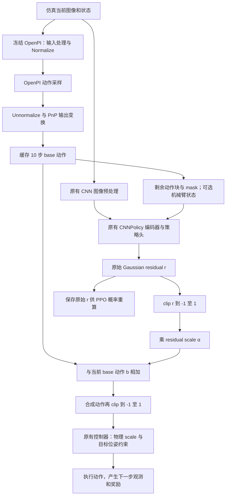

# OpenPI + Residual PPO：本地实现与修改对照说明

整理日期：2026-09-07；依据本地 residual 重构后的代码快照。本文描述当前实现，不代表已经通过仿真训练验证。

本地仓库：`C:/Users/34855/Documents/Codex/Projects/RLinf-4090`。对应 4090 仓库：`/home/ubuntu/wangyinghan/wangyitao`；两者使用相同仓库相对路径。本文的源码链接指向本地绝对路径和当前行号，代码变化后请优先按函数名定位。此次交付仅增加说明文档，没有同步服务器或启动训练。

## 1. 先回答最容易混淆的问题

| 问题 | 当前代码的处理 |
| --- | --- |
| residual 在 OpenPI norm 前还是后？ | 在 OpenPI **动作 Unnormalize（反归一化）及全部输出变换之后**。不是直接加在模型内部归一化动作上。 |
| 是直接加吗？ | 先将 residual 采样动作裁剪到 `[-1,1]`，乘 residual scale，再与 base 当前步动作相加，最后再次裁剪。 |
| “skill 之后加”是什么意思？ | 本文先按你指的是 **scale** 来解释。residual 自己的 scale 在相加前；控制器的物理 scale 在相加后。当前没有新增 skill 选择器或技能模块。 |
| residual 输入只有 SFT 输出吗？ | 当前相机图像 + 剩余 base 动作块 + 有效步 mask；可以额外加入机械臂状态。不是只输入 SFT 输出。 |
| 原始数据会再参与训练吗？ | 读取在线仿真观测。当前没有接入历史 LeRobot 数据集、BC loss 或离线 replay buffer；SFT 数据通过冻结 checkpoint 和 norm stats 间接起作用。 |
| PPO 更新谁？ | residual 的可训练部分及 value head。OpenPI 冻结；ResNet backbone 默认也按原有 CNN 设置冻结。 |
| 当前跑通了吗？ | 静态检查通过；本地 PyTorch DLL 导入失败，运行测试、Ray/FSDP 和实际 checkpoint 仿真还未验证。 |

## 2. 完整动作链路：区分三种不同的尺度处理



### 2.1 OpenPI 的统计归一化：沿用原有实现

OpenPI 加载 checkpoint 对应的 norm stats，输入链中调用 `Normalize`；预测后经过 `model_transforms.outputs → Unnormalize → data_transforms.outputs → repack_transforms.outputs`。`predict_action_batch()` 返回的是 `output_transform(...)["actions"]`。缓存拿到这个返回值后才参与 residual 合成。

对照：[rlinf/models/embodiment/openpi/__init__.py](C:/Users/34855/Documents/Codex/Projects/RLinf-4090/rlinf/models/embodiment/openpi/__init__.py:106)、[rlinf/models/embodiment/openpi/openpi_action_model.py](C:/Users/34855/Documents/Codex/Projects/RLinf-4090/rlinf/models/embodiment/openpi/openpi_action_model.py:531)。这两处是**原有实现，本次 residual 接入复用它们，没有改动它们**。

PnP 数据配置注明采集动作已经是 EE delta pose + gripper，不再额外应用一次 `DeltaActions`；`PnPOutputs` 取出环境需要的前 7 维。对照：[rlinf/models/embodiment/openpi/dataconfig/pnp_dataconfig.py](C:/Users/34855/Documents/Codex/Projects/RLinf-4090/rlinf/models/embodiment/openpi/dataconfig/pnp_dataconfig.py:17)、[rlinf/models/embodiment/openpi/policies/pnp_policy.py](C:/Users/34855/Documents/Codex/Projects/RLinf-4090/rlinf/models/embodiment/openpi/policies/pnp_policy.py:81)。

**反归一化恢复的是训练数据里的动作表达，不自动意味着已经换成米/弧度。** 当前仿真接入要求它与归一化增量控制器输入一致；实际 checkpoint 的采集动作是否确实遵守该约定，仍需 checkpoint-backed smoke test 验证。若数据保存的是物理增量，这个接法需要先做单位适配，不能直接沿用。

### 2.2 residual 自身的缩放：加法之前

设当前缓存动作为 `b`，residual 的原始 Gaussian 输出为 `r`，修正比例为 `α`：

```python
r_bounded = clip(r, -1, 1)
delta = alpha * r_bounded
a_env = clip(b + delta, -1, 1)
```

当前默认：`α = [0.1, 0.1, 0.1, 0.1, 0.1, 0.1, 0.0]`。前 6 维为机械臂修正，最后一维不修正夹爪。没有 tanh squash，也没有把 residual 送进 OpenPI 的 Unnormalize 再处理一次。

代码入口：[rlinf/envs/residual.py](C:/Users/34855/Documents/Codex/Projects/RLinf-4090/rlinf/envs/residual.py:90)。调用位置：[rlinf/envs/maniskill/residual_maniskill_env.py](C:/Users/34855/Documents/Codex/Projects/RLinf-4090/rlinf/envs/maniskill/residual_maniskill_env.py:29) 的 `step()`；参数来源：[examples/embodiment/config/model/residual_policy.yaml](C:/Users/34855/Documents/Codex/Projects/RLinf-4090/examples/embodiment/config/model/residual_policy.yaml:1) 中的 `residual_action_scale`，经 [examples/embodiment/config/maniskill_pick_and_place_ppo_residual.yaml](C:/Users/34855/Documents/Codex/Projects/RLinf-4090/examples/embodiment/config/maniskill_pick_and_place_ppo_residual.yaml:1) 插值到环境的 `residual.action_scale`。

注意顺序是 `clip(b + delta)`，**没有先单独 clip(b) 再加 delta**。当 base 越界或合成动作饱和时，实际修正量不再等于 `delta`。

### 2.3 控制器的物理缩放：加法之后

`a_env` 进入原有 `ManiskillEnv.step()`，最终交给原有机器人控制器。当前环境配置 `controller_alignment.action_scale = [0.01, 0.05, 1.0]`，分别对应位置、旋转、夹爪尺度。

机械臂控制器先限制动作范围，再将前 3 维乘位置 scale、旋转 3 维乘旋转 scale，计算目标位姿，并施加原有目标位姿范围约束。

对照：[examples/embodiment/config/env/maniskill_pick_and_place_co_rl.yaml](C:/Users/34855/Documents/Codex/Projects/RLinf-4090/examples/embodiment/config/env/maniskill_pick_and_place_co_rl.yaml:57)、[rlinf/envs/maniskill/tasks/digital_twin/controller/safe_pd_ee_pose.py](C:/Users/34855/Documents/Codex/Projects/RLinf-4090/rlinf/envs/maniskill/tasks/digital_twin/controller/safe_pd_ee_pose.py:72)、[rlinf/envs/maniskill/tasks/digital_twin/robots/panda_umi.py](C:/Users/34855/Documents/Codex/Projects/RLinf-4090/rlinf/envs/maniskill/tasks/digital_twin/robots/panda_umi.py:1)。这些属于原有 PnP 仿真链路，此次 residual 没有改写控制器。

以某个位置轴为例，`b=0.4`、`r=0.3`：`delta=0.1×0.3=0.03`，合成输入 `0.43`，位置尺度换算为 `0.43×0.01=0.0043 m`。与 base 相比，目标增量多 `0.0003 m`，即 `0.3 mm`。这是控制器尺度换算例子，不保证机械臂实际移动同样距离。

若 `b=0.99`、`r=2`，先得 `clip(r)=1`，再加 `0.1` 得 `1.09`，最终限制为 `1`。因此这一轴实际增加的控制器输入只有 `0.01`。

在没有饱和和位姿约束影响时，默认每轴最大位置修正对应 `0.1×0.01=0.001 m`，旋转输入修正对应 `0.1×0.05=0.005 rad`。这些是每控制步的目标增量尺度，不是物理运动保证。当前仿真 `control_freq=5`，并不意味着真机时间尺度已经对齐。

## 3. residual 观测怎么处理

主要入口：[rlinf/envs/maniskill/residual_maniskill_env.py](C:/Users/34855/Documents/Codex/Projects/RLinf-4090/rlinf/envs/maniskill/residual_maniskill_env.py:90) → [rlinf/models/embodiment/residual_policy/residual_policy.py](C:/Users/34855/Documents/Codex/Projects/RLinf-4090/rlinf/models/embodiment/residual_policy/residual_policy.py:85) → 原有 [rlinf/models/embodiment/cnn_policy/cnn_policy.py](C:/Users/34855/Documents/Codex/Projects/RLinf-4090/rlinf/models/embodiment/cnn_policy/cnn_policy.py:363)。

| 数据 | 环境传来的形状（B 为并行环境数） | residual 处理 |
| --- | --- | --- |
| `main_images` | `[B,128,128,3]`，uint8 | 原有 CNN：转 float、除 255、ImageNet mean/std 归一化，再按编码器需要变换布局。 |
| `extra_view_images` | 默认 `[B,1,128,128,3]` | 第二相机视角，沿用同样的 CNN 预处理。 |
| `base_actions` | `[B,10,7]` | 反归一化后的剩余动作，末尾补零；乘 mask 后展平成 70 维。不再套 OpenPI norm stats。 |
| `base_action_mask` | `[B,10]`，bool | 转成数值 0/1，与动作条件拼接。 |
| 原始 `states` | 启用时 `[B,14]` | 可选追加；可通过 `state_mean/state_std` 做独立标准化，默认不做。 |

图像的中心裁剪与 128×128 resize 已由原有 PnP 环境完成，residual 环境不再额外 resize。对照：[rlinf/envs/maniskill/tasks/digital_twin/push_button.py](C:/Users/34855/Documents/Codex/Projects/RLinf-4090/rlinf/envs/maniskill/tasks/digital_twin/push_button.py:532)。

### 3.1 state 开关为什么关了，代码里仍然出现 states

`actor.model.use_state=false` 的含义是**不让 residual 直接读取机械臂原始状态**。OpenPI 仍要读它 SFT 时使用的状态，因此原始环境的 `include_states_in_obs=true` 保留；调用 OpenPI、取得 base 动作之后，residual 环境才删除发往 residual 的原始状态。

为复用 CNNPolicy，residual 把 base 条件放入原有数值 `states` 通道：

- 关闭原始状态：`flatten(base_actions×mask) + mask`，总计 `70+10=80` 维。
- 开启原始状态：再拼接 14 维机械臂状态，总计 `94` 维。

这里的“+”表示拼接，不是元素相加。配置中的 `state_dim=14` 描述可选机械臂状态；内部 CNN 使用一份配置副本，把维度设为 80/94，不改写用户 YAML。可选 state 标准化只作用于追加的 14 维，base 条件的均值/标准差使用 0/1。

关闭直接 state 输入后，base 动作仍可能携带状态信息，所以不能把整个系统称为完全无状态。实现：[rlinf/models/embodiment/residual_policy/residual_policy.py](C:/Users/34855/Documents/Codex/Projects/RLinf-4090/rlinf/models/embodiment/residual_policy/residual_policy.py:35) 的构造函数与 `_prepare_cnn_obs()`。

### 3.2 动作块缓存为什么是 10 步，而 residual 是 1 步

OpenPI 每次推理提供 10 步 base 动作，residual 每个控制步重新读取相机观测并输出一条修正。执行第 k 步时，条件是从缓存位置开始的剩余计划，不重新推理前面已执行的动作。

例如当前 chunk 已执行 3 步，条件为剩余 7 个 base 动作 + 3 个零动作，mask 为 7 个 1 + 3 个 0。缓存用尽后，下次观测处理才重新调用 OpenPI。

因此 residual 能根据新图像纠偏，但 chunk 内的 base 计划是旧观测生成的；mask 告诉网络当前计划还剩多少步。缓存按每个并行环境分别管理。实现：[rlinf/envs/residual.py](C:/Users/34855/Documents/Codex/Projects/RLinf-4090/rlinf/envs/residual.py:20) 的 `refresh()`、`observation()`、`compose()`。

## 4. CNN 和 PPO 的数据：采样动作与执行动作不同

[rlinf/models/embodiment/residual_policy/residual_policy.py](C:/Users/34855/Documents/Codex/Projects/RLinf-4090/rlinf/models/embodiment/residual_policy/residual_policy.py:35) 继承 [rlinf/models/embodiment/cnn_policy/cnn_policy.py](C:/Users/34855/Documents/Codex/Projects/RLinf-4090/rlinf/models/embodiment/cnn_policy/cnn_policy.py:91)，复用 ResNet 编码器、数值状态投影、特征融合、Gaussian actor、value head；没有新增 PPO 数学公式实现。

内部策略默认只学习 6 个活跃动作通道，返回时扩展成 7 维，第 7 维补零。对应的 logprob 和 entropy 同样补零，避免给不参与控制的夹爪维度计算额外策略损失或熵奖励。

Actor 均值头权重和偏置初始化为零。`initial_logstd=-3`，初始标准差约 `exp(-3)=0.0498`，logstd 范围为 `[-5,-1]`。

**零初始化只表示初始均值为零。训练模式仍会采样噪声，不是严格 base-only；评估模式使用均值。** 要做明确的 base-only 对照，使用 `runner.only_eval=true actor.model.enabled=false`。

### 4.1 rollout 保存什么

实现：[rlinf/models/embodiment/residual_policy/residual_policy.py](C:/Users/34855/Documents/Codex/Projects/RLinf-4090/rlinf/models/embodiment/residual_policy/residual_policy.py:140)，底层采样：[rlinf/models/embodiment/cnn_policy/cnn_policy.py](C:/Users/34855/Documents/Codex/Projects/RLinf-4090/rlinf/models/embodiment/cnn_policy/cnn_policy.py:617)。

| 字段 | 内容 | 用途 |
| --- | --- | --- |
| `forward_inputs.action` | 扩展后的原始 Gaussian residual，`[B,7]`，未乘 residual scale、未 clip | PPO 重算同一采样动作的概率。 |
| `forward_inputs.main_images/extra_view_images` | 原始 uint8 图像 | 更新时重新走同一 CNN 预处理。 |
| `forward_inputs.states` | 已拼接的 80/94 维条件 | 更新时使用当时的 base 计划，不重新查询缓存/OpenPI。 |
| `prev_logprobs` | 旧 residual 策略对原始采样动作的 logprob | PPO ratio。 |
| `prev_values` | 同一观测下旧 value 估计 | GAE、value clipping。 |
| 环境 `info.residual_executed_action` | `clip(base + scale×clip(residual))` | 记录本步发给环境的合成动作；当前不自动成为 TensorBoard 指标。 |

环境传输阶段保留独立的 `base_actions/base_action_mask`；进入策略后将它们打包为 `states` 保存，训练不需要再保存一份独立 base 字段。对照：[rlinf/data/embodied_io_struct.py](C:/Users/34855/Documents/Codex/Projects/RLinf-4090/rlinf/data/embodied_io_struct.py:99)。Residual 保存的 forward input 张量会 detach/clone，防止后续环境或缓存变化覆盖旧样本。

### 4.2 为什么 PPO 不用最终合成动作计算 logprob

策略实际采样的是 residual 随机变量 `r`。PPO 的比值应是当前策略与旧策略对**同一个 r**的概率比；`b`、scale 和裁剪是环境执行映射的一部分。

更新时，[rlinf/models/embodiment/residual_policy/residual_policy.py](C:/Users/34855/Documents/Codex/Projects/RLinf-4090/rlinf/models/embodiment/residual_policy/residual_policy.py:127) 选出保存动作的 6 个有效维度，调用原有 [rlinf/models/embodiment/cnn_policy/cnn_policy.py](C:/Users/34855/Documents/Codex/Projects/RLinf-4090/rlinf/models/embodiment/cnn_policy/cnn_policy.py:544)，计算 Gaussian `log_prob` 和解析熵，再把 inactive 通道补零。GAE 与 actor/critic loss 分别复用 [rlinf/algorithms/advantages.py](C:/Users/34855/Documents/Codex/Projects/RLinf-4090/rlinf/algorithms/advantages.py:25)、[rlinf/algorithms/losses.py](C:/Users/34855/Documents/Codex/Projects/RLinf-4090/rlinf/algorithms/losses.py:391)。

因此当前没有 tanh 的 log-Jacobian 校正；熵也是原始 Gaussian residual 的熵，不是裁剪后执行动作分布的熵。多个大 residual 可能被裁剪为同一个动作，这是执行映射的性质；以后调探索幅度时需要关注裁剪比例，当前未新增该指标。

## 5. 谁加载模型、谁训练，以及 reset 处理

- **env worker**：通过 [rlinf/envs/maniskill/residual_maniskill_env.py](C:/Users/34855/Documents/Codex/Projects/RLinf-4090/rlinf/envs/maniskill/residual_maniskill_env.py:62) 延迟加载冻结 OpenPI，`requires_grad_(False)`、`eval()`，推理缓存函数也关闭梯度。相同进程、设备和配置的 train/eval 环境共享 base 权重，各自维护动作缓存。不是所有 Ray 进程共享一个模型。
- **rollout worker**：只运行 residual CNN。PPO 所需观测保存走原有 CNN 分支。对照：[rlinf/workers/rollout/hf/huggingface_worker.py](C:/Users/34855/Documents/Codex/Projects/RLinf-4090/rlinf/workers/rollout/hf/huggingface_worker.py:360)。
- **actor worker**：训练 residual 和 value，沿用 [rlinf/workers/actor/fsdp_actor_worker.py](C:/Users/34855/Documents/Codex/Projects/RLinf-4090/rlinf/workers/actor/fsdp_actor_worker.py:925) 与 [rlinf/runners/embodied_runner.py](C:/Users/34855/Documents/Codex/Projects/RLinf-4090/rlinf/runners/embodied_runner.py:272)。没有 OpenPI 参数随 residual actor 同步。
- **默认冻结的 CNN 部分**：[rlinf/models/embodiment/modules/resnet_utils.py](C:/Users/34855/Documents/Codex/Projects/RLinf-4090/rlinf/models/embodiment/modules/resnet_utils.py:98) 中 ResNet backbone 默认冻结；pooling/projection、状态投影、融合、actor 和 value 可训练。`encoder_config.dropout=0.0` 用于避免 rollout/eval 与训练模式的 dropout 差异。开启 backbone 训练要设置 `+actor.model.encoder_config.freeze_backbone=false`。

Reset 入口在 [rlinf/envs/maniskill/residual_maniskill_env.py](C:/Users/34855/Documents/Codex/Projects/RLinf-4090/rlinf/envs/maniskill/residual_maniskill_env.py:29)：先让对应环境缓存失效，再调用父环境 reset，包装新观测时补充新 base 计划。部分环境 reset 不清除其他环境的计划。`compose()` 只在实际 step 时推进位置，额外 value 计算不消耗计划。

原有 [rlinf/envs/maniskill/maniskill_env.py](C:/Users/34855/Documents/Codex/Projects/RLinf-4090/rlinf/envs/maniskill/maniskill_env.py:311) 负责 terminated/truncated、自动 reset 和 final observation。新增包装使下一步/终止观测也带有 base 条件；`EnvOutput` 负责继续传输这些字段。这个 terminal/timeout 链路目前按代码接口接入，**尚未完成真实 ManiSkill 自动 reset 与 bootstrap 的端到端验证**，不能把单独缓存测试视为该链路已通过。

## 6. 文件修改清单：新增、接入、原有复用分开看

以下仅归纳 residual 工作的改动。仓库原先已有很多未提交修改；不能把当前整个 `git diff` 都算作 residual 修改。

### 6.1 新增文件

| 文件 | 负责什么／建议看哪里 |
| --- | --- |
| [rlinf/models/embodiment/residual_policy/residual_policy.py](C:/Users/34855/Documents/Codex/Projects/RLinf-4090/rlinf/models/embodiment/residual_policy/residual_policy.py:35) | `ResidualConfig`、CNN 子类、条件拼接、动作通道映射、PPO forward 适配。 |
| [rlinf/models/embodiment/residual_policy/__init__.py](C:/Users/34855/Documents/Codex/Projects/RLinf-4090/rlinf/models/embodiment/residual_policy/__init__.py:19) | 按原有 CNN dataclass 工厂方式构建模型，调用配置加载流程。 |
| [rlinf/models/embodiment/residual_policy/validation.py](C:/Users/34855/Documents/Codex/Projects/RLinf-4090/rlinf/models/embodiment/residual_policy/validation.py:20) | residual 专用配置约束：PPO/GAE、1-step、value head、动作 scale 与活跃通道一致、base/environment 匹配等。 |
| [rlinf/envs/residual.py](C:/Users/34855/Documents/Codex/Projects/RLinf-4090/rlinf/envs/residual.py:20) | base 动作缓存、mask、部分 reset、动作裁剪和合成。 |
| [rlinf/envs/maniskill/residual_maniskill_env.py](C:/Users/34855/Documents/Codex/Projects/RLinf-4090/rlinf/envs/maniskill/residual_maniskill_env.py:29) | 冻结 base 生命周期、给观测附加条件、把 residual 转成环境动作。 |
| [examples/embodiment/config/model/residual_policy.yaml](C:/Users/34855/Documents/Codex/Projects/RLinf-4090/examples/embodiment/config/model/residual_policy.yaml:1) | 继承原有 CNN 模型配置，补充 residual 参数与 state 开关。 |
| [examples/embodiment/config/maniskill_pick_and_place_ppo_residual.yaml](C:/Users/34855/Documents/Codex/Projects/RLinf-4090/examples/embodiment/config/maniskill_pick_and_place_ppo_residual.yaml:1) | 复用原有 PnP 环境、pi0_5 base 和 FSDP 配置，组织 PPO 实验。 |
| [examples/embodiment/run_maniskill_residual.sh](C:/Users/34855/Documents/Codex/Projects/RLinf-4090/examples/embodiment/run_maniskill_residual.sh:1) | 薄启动脚本，调用已有 `train_embodied_agent.py`，传递 Hydra 参数和日志路径。 |
| [tests/unit_tests/test_residual_policy.py](C:/Users/34855/Documents/Codex/Projects/RLinf-4090/tests/unit_tests/test_residual_policy.py:1) | CNN 对照、PPO 更新、state、缓存与配置测试。 |
| [docs/source-zh/rst_source/examples/embodied/residual.rst](C:/Users/34855/Documents/Codex/Projects/RLinf-4090/docs/source-zh/rst_source/examples/embodied/residual.rst:1)、[docs/source-en/rst_source/examples/embodied/residual.rst](C:/Users/34855/Documents/Codex/Projects/RLinf-4090/docs/source-en/rst_source/examples/embodied/residual.rst:1) | 中英文使用说明。本文补充更细的处理顺序与文件对照。 |

### 6.2 原文件上的接入改动

| 文件 | residual 接入位置 | 为什么需要 |
| --- | --- | --- |
| [rlinf/config.py](C:/Users/34855/Documents/Codex/Projects/RLinf-4090/rlinf/config.py:61)；[rlinf/config.py](C:/Users/34855/Documents/Codex/Projects/RLinf-4090/rlinf/config.py:756) | 新增 `SupportedModel.RESIDUAL_POLICY`，调用专用 validator | 接入原有模型类型与配置验证。 |
| [rlinf/models/__init__.py](C:/Users/34855/Documents/Codex/Projects/RLinf-4090/rlinf/models/__init__.py:41) | 新增 residual 工厂分支 | actor/rollout 通过统一 `get_model` 构造。 |
| [rlinf/envs/__init__.py](C:/Users/34855/Documents/Codex/Projects/RLinf-4090/rlinf/envs/__init__.py:49) | ManiSkill 配置包含 `residual` 时选择新子类 | 原有环境注册入口识别适配层。 |
| [rlinf/data/embodied_io_struct.py](C:/Users/34855/Documents/Codex/Projects/RLinf-4090/rlinf/data/embodied_io_struct.py:99) | `prepare_observations` 保留 `base_actions/base_action_mask` | 原有固定字段过滤会丢掉新增条件。 |
| [rlinf/workers/rollout/hf/huggingface_worker.py](C:/Users/34855/Documents/Codex/Projects/RLinf-4090/rlinf/workers/rollout/hf/huggingface_worker.py:360) | residual 与 CNN 共用 mode、return_obs 分支 | 使用原有 PPO 采样与观测保存方式。 |
| [.gitignore](C:/Users/34855/Documents/Codex/Projects/RLinf-4090/.gitignore:38) | 为 residual 单测增加忽略规则例外 | 原有规则忽略了该测试目录的大部分文件。 |
| 中英文 embodied 文档 `index.rst` | 注册 `residual` 页面 | 在原有文档目录展示新增示例。 |

### 6.3 重要的原有代码：复用，不是本次新增算法

- [rlinf/models/embodiment/cnn_policy/cnn_policy.py](C:/Users/34855/Documents/Codex/Projects/RLinf-4090/rlinf/models/embodiment/cnn_policy/cnn_policy.py:91)、[rlinf/models/embodiment/modules/resnet_utils.py](C:/Users/34855/Documents/Codex/Projects/RLinf-4090/rlinf/models/embodiment/modules/resnet_utils.py:98)：网络与 Gaussian PPO 计算。
- [rlinf/models/embodiment/openpi/__init__.py](C:/Users/34855/Documents/Codex/Projects/RLinf-4090/rlinf/models/embodiment/openpi/__init__.py:106)、[rlinf/models/embodiment/openpi/openpi_action_model.py](C:/Users/34855/Documents/Codex/Projects/RLinf-4090/rlinf/models/embodiment/openpi/openpi_action_model.py:531)：OpenPI 输入和动作输出变换。
- [rlinf/algorithms/advantages.py](C:/Users/34855/Documents/Codex/Projects/RLinf-4090/rlinf/algorithms/advantages.py:25)、[rlinf/algorithms/losses.py](C:/Users/34855/Documents/Codex/Projects/RLinf-4090/rlinf/algorithms/losses.py:391)：GAE 与 PPO loss。
- [rlinf/workers/actor/fsdp_actor_worker.py](C:/Users/34855/Documents/Codex/Projects/RLinf-4090/rlinf/workers/actor/fsdp_actor_worker.py:925)、[rlinf/runners/embodied_runner.py](C:/Users/34855/Documents/Codex/Projects/RLinf-4090/rlinf/runners/embodied_runner.py:272)：更新和训练循环。
- [examples/embodiment/config/env/maniskill_pick_and_place_co_rl.yaml](C:/Users/34855/Documents/Codex/Projects/RLinf-4090/examples/embodiment/config/env/maniskill_pick_and_place_co_rl.yaml:57)、[rlinf/envs/maniskill/tasks/digital_twin/controller/safe_pd_ee_pose.py](C:/Users/34855/Documents/Codex/Projects/RLinf-4090/rlinf/envs/maniskill/tasks/digital_twin/controller/safe_pd_ee_pose.py:72)：环境奖励、控制频率、物理动作尺度等。
- [examples/embodiment/config/model/cnn_policy.yaml](C:/Users/34855/Documents/Codex/Projects/RLinf-4090/examples/embodiment/config/model/cnn_policy.yaml:1)、[examples/embodiment/config/model/pi0_5.yaml](C:/Users/34855/Documents/Codex/Projects/RLinf-4090/examples/embodiment/config/model/pi0_5.yaml:1)：CNN 与 OpenPI 模型配置默认值。

本次没有为 residual 改写以上原有实现；其中有些文件本来就存在你的其他改动。先前 residual 原型的独立小 CNN、tanh 概率计算已被替换；动作缓存已从模型目录移到环境目录。当前不再使用单独的 `pi05_pnp_residual_base` 文件，base 专用覆盖统一放在实验 YAML。

## 7. 配置、权重路径与当前支持范围

| 配置 | 当前含义 |
| --- | --- |
| `base_model.model_path` | 冻结 OpenPI SFT checkpoint；当前实验填写此前使用的 `pi05_pnp_sim500_real250_success_20260905_state_10k` 路径。 |
| `actor.model.model_path` | 原有 CNN 的 `resnet10_pretrained.pt` 所在目录，当前为空，启动前需要补齐。 |
| `rollout.model.model_path` | 插值引用 actor CNN 权重目录。 |
| `runner.ckpt_path` | 评估用 residual 权重，不填写 OpenPI 权重。 |
| `runner.resume_dir` | 原有 RLinf 训练恢复目录。 |
| `actor.model.use_state` | 默认 false；是否追加原始机械臂状态。 |
| `actor.model.residual_action_scale` | 默认前六维 0.1、夹爪 0；这是 residual scale。 |
| `env.*.init_params.controller_alignment.action_scale` | 当前继承 `[0.01,0.05,1.0]`；这是控制器物理 scale。 |
| `algorithm.adv_type/loss_type` | `gae` / `decoupled_actor_critic`，现有 PPO。 |
| `algorithm.update_epoch/gamma/gae_lambda` | `4 / 0.99 / 0.95`。 |
| `runner.val_check_interval` | 默认 -1，不在训练中定期自动评估。 |

Base 的 `num_action_chunks/action_chunk/action_horizon` 均明确设为 10，residual 的 `num_action_chunks=1`。原有 pi0_5 YAML 内有引用 actor.model 的插值；此处 actor 已经是 residual，因此实验 YAML 显式覆盖 base 的相关参数，避免错误地把 base chunk 变成 1。

当前 validator 限定：单节点、单 pipeline stage、ManiSkill 仿真、指定 PnP 控制模式、原始 base 状态可用、环境不 offload、float32 residual、FSDP `use_orig_params=true`。这是初版支持范围的约束，不是 residual RL 理论上只能这样运行。真机与 co-training 尚未接入；不要直接把 env_type 换成 realworld 就当作已经适配。

Residual checkpoint 包含 residual 网络（包括其冻结 CNN backbone）的状态，不包含 OpenPI。部署/恢复仍需保留 base checkpoint、CNN 所需初始化文件、norm assets 及实验配置。关闭 residual 的评估路径仍会构建 CNN，当前也需要 CNN 预训练文件。

## 8. 已验证、未验证和建议对比顺序

已完成：本地 Python AST 检查、两份新增 YAML 语法解析、Black 与 Pyflakes 检查。YAML 能解析不等于 Hydra 完整配置已实际 compose 成功。

已编写但未运行通过的测试见 [tests/unit_tests/test_residual_policy.py](C:/Users/34855/Documents/Codex/Projects/RLinf-4090/tests/unit_tests/test_residual_policy.py:1)，包括 state 开关、初始零均值、夹爪屏蔽、缓存边界/部分 reset、观测字段保留、原始 Gaussian 概率重算、使用原有 PPO loss 的更新，以及与原生 CNN 在相同权重/随机种子下对照。

测试阻塞：本机 Windows PyTorch 导入 `c10.dll` 失败，pytest 在收集阶段中断。尚未验证完整 Hydra 初始化、Ray/FSDP 同步、实际 OpenPI norm assets、仿真 final observation/自动 reset、恢复训练和训练收益；也没有运行硬件实验。

建议代码阅读顺序：

1. [rlinf/envs/residual.py](C:/Users/34855/Documents/Codex/Projects/RLinf-4090/rlinf/envs/residual.py:90)：确认最终加法、scale 和 clip。
2. [rlinf/models/embodiment/openpi/__init__.py](C:/Users/34855/Documents/Codex/Projects/RLinf-4090/rlinf/models/embodiment/openpi/__init__.py:106)、[rlinf/models/embodiment/openpi/openpi_action_model.py](C:/Users/34855/Documents/Codex/Projects/RLinf-4090/rlinf/models/embodiment/openpi/openpi_action_model.py:531)：确认 base 返回值已经 Unnormalize。
3. [rlinf/envs/maniskill/tasks/digital_twin/controller/safe_pd_ee_pose.py](C:/Users/34855/Documents/Codex/Projects/RLinf-4090/rlinf/envs/maniskill/tasks/digital_twin/controller/safe_pd_ee_pose.py:72)、[examples/embodiment/config/env/maniskill_pick_and_place_co_rl.yaml](C:/Users/34855/Documents/Codex/Projects/RLinf-4090/examples/embodiment/config/env/maniskill_pick_and_place_co_rl.yaml:57)：确认加法后才换算控制器物理尺度。
4. [rlinf/models/embodiment/residual_policy/residual_policy.py](C:/Users/34855/Documents/Codex/Projects/RLinf-4090/rlinf/models/embodiment/residual_policy/residual_policy.py:85)：确认图像、base 条件、state 的输入方式。
5. [rlinf/models/embodiment/residual_policy/residual_policy.py](C:/Users/34855/Documents/Codex/Projects/RLinf-4090/rlinf/models/embodiment/residual_policy/residual_policy.py:140)、[rlinf/models/embodiment/residual_policy/residual_policy.py](C:/Users/34855/Documents/Codex/Projects/RLinf-4090/rlinf/models/embodiment/residual_policy/residual_policy.py:127)、[rlinf/models/embodiment/cnn_policy/cnn_policy.py](C:/Users/34855/Documents/Codex/Projects/RLinf-4090/rlinf/models/embodiment/cnn_policy/cnn_policy.py:544)：确认 PPO 保存并重算的是原始 residual。
6. [rlinf/envs/maniskill/residual_maniskill_env.py](C:/Users/34855/Documents/Codex/Projects/RLinf-4090/rlinf/envs/maniskill/residual_maniskill_env.py:29)、[rlinf/data/embodied_io_struct.py](C:/Users/34855/Documents/Codex/Projects/RLinf-4090/rlinf/data/embodied_io_struct.py:99)：确认 reset、next/final observation 与传输接口。
7. [examples/embodiment/config/maniskill_pick_and_place_ppo_residual.yaml](C:/Users/34855/Documents/Codex/Projects/RLinf-4090/examples/embodiment/config/maniskill_pick_and_place_ppo_residual.yaml:1)、[tests/unit_tests/test_residual_policy.py](C:/Users/34855/Documents/Codex/Projects/RLinf-4090/tests/unit_tests/test_residual_policy.py:1)：核对参数，然后在可用 Linux 环境中验证。

本文记录的是当前实现。任何 base 动作单位、控制模式、chunk 长度或 state 维度的变更，都需要重新核对这些接口，不能仅凭模型能够前向推理判断兼容性。
